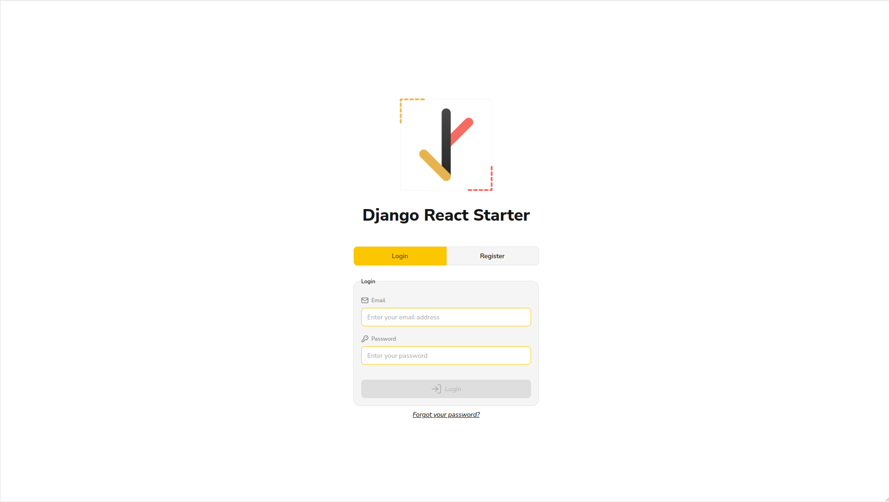
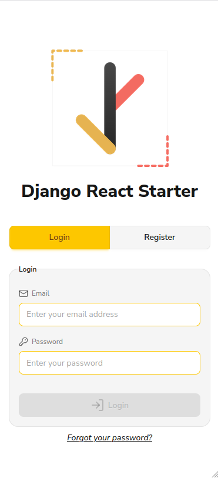
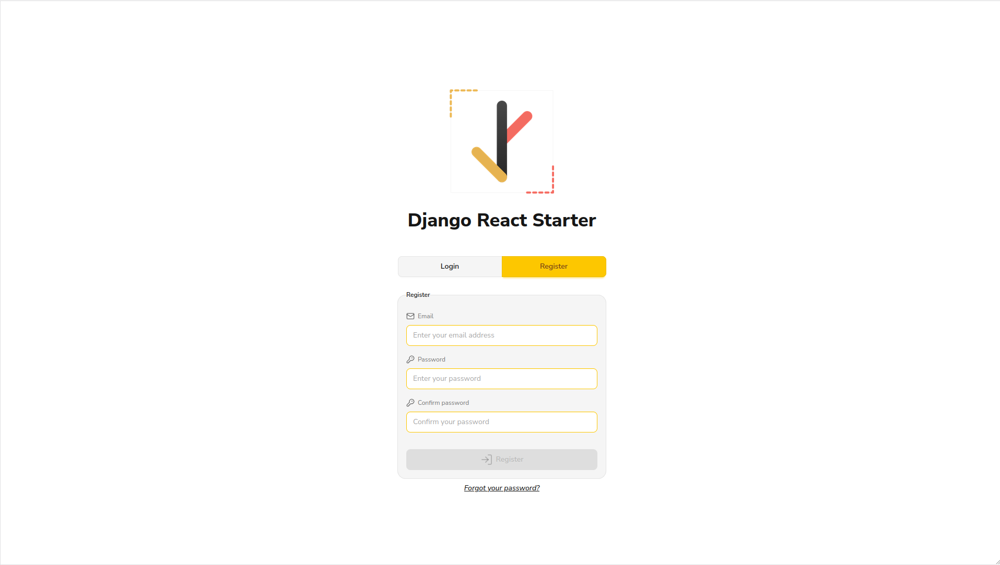
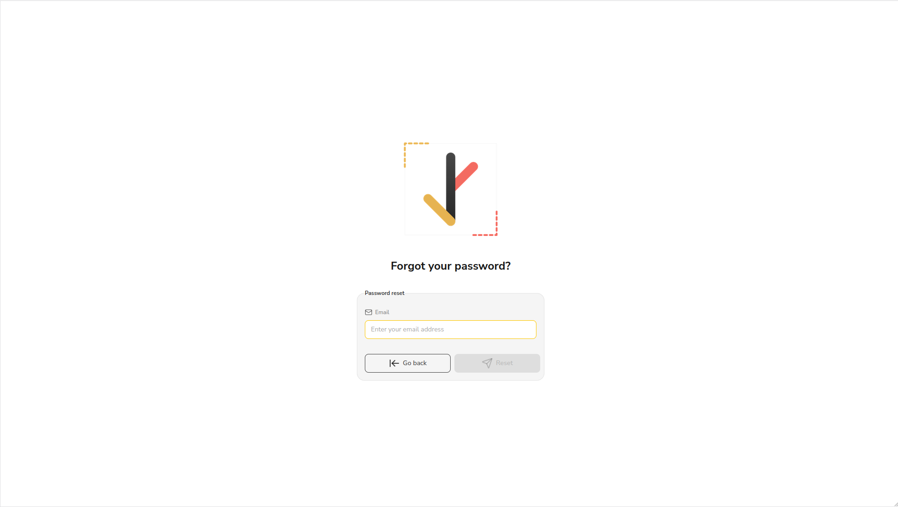
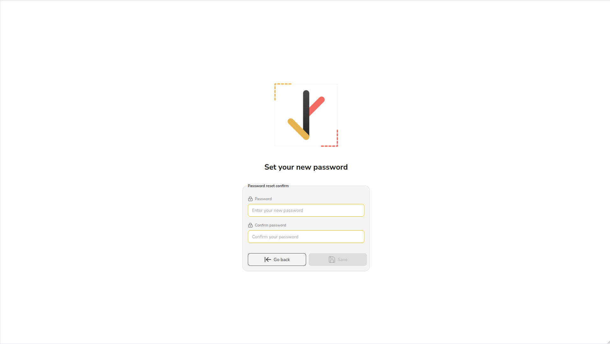
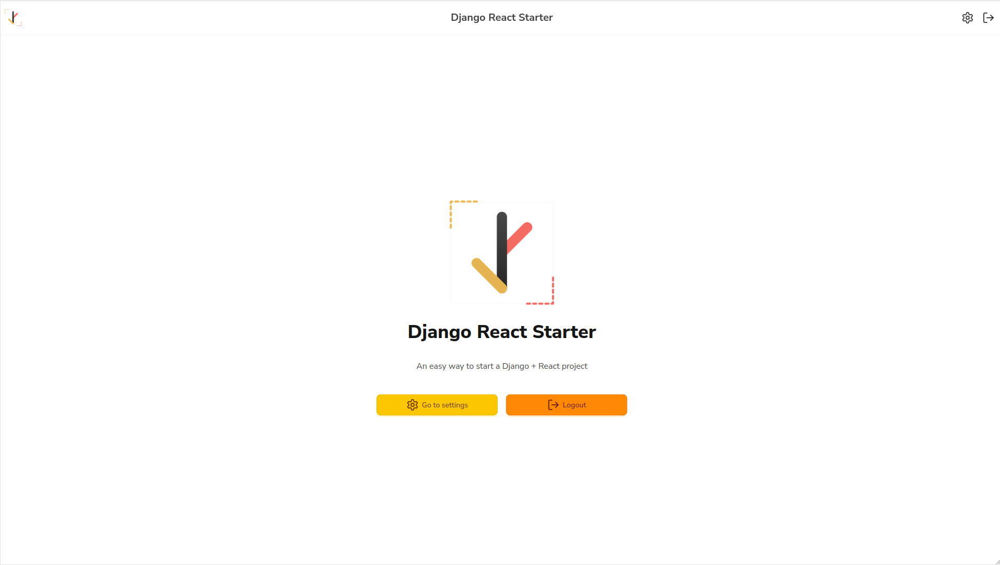
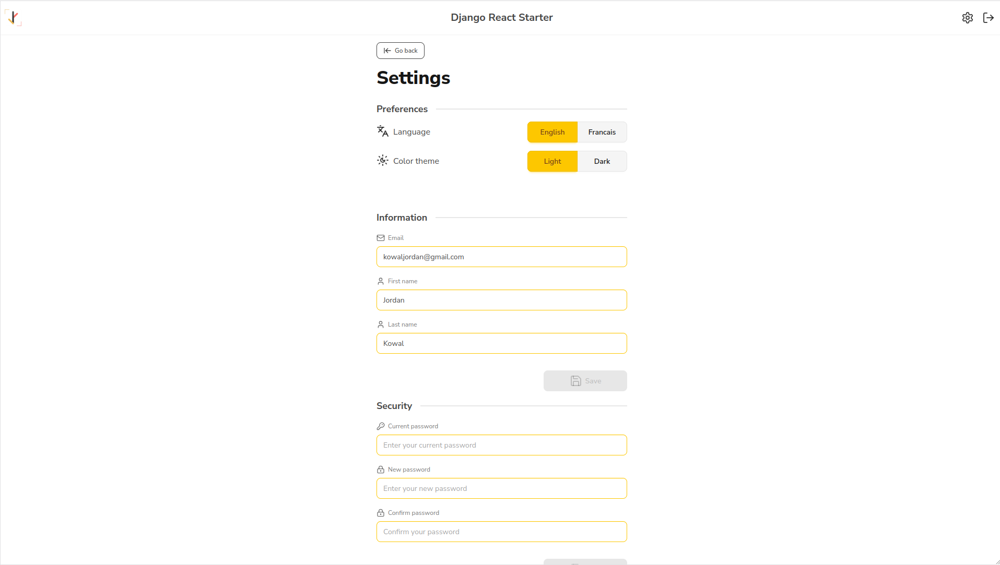
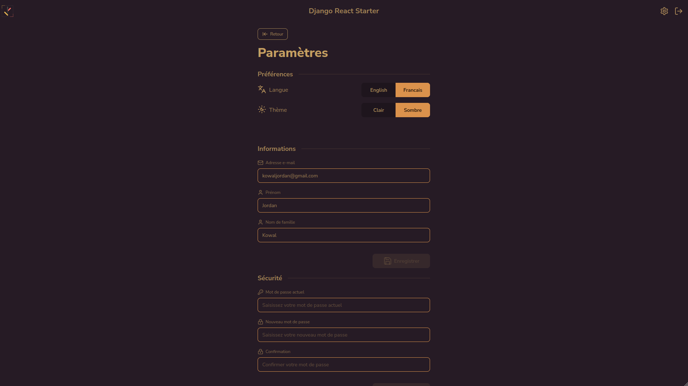

# ✨ Django React Starter ✨

- [✨ Django React Starter ✨](#-django-react-starter-)
  - [⚡ Getting started](#-getting-started)
  - [📕 Main Features](#-main-features)
  - [🔗 Useful links](#-useful-links)
  - [⏳ Stats](#-stats)

Django-React starter with Docker support for fast and easy web development with:

🥷 **Backend**: Django + DRF + Celery 
✨ **Frontend**: Vite + React + DaisyUI 
💻 **Database**: Postgres + PostGIS 
🔍 **Search engine**: Meilisearch and its UI 
🗨️ **Messaging**: RabbitMQ 
🚀 **Deployment**: Fly.io 

| Login                    | Responsive                         |
|--------------------------|------------------------------------|
|  |  |

| Register                       | Password reset                             | Password reset confirm                                     |
|--------------------------------|--------------------------------------------|------------------------------------------------------------|
|  |  |  |

| Homepage                       | Settings                       | Dark mode and i18n French            |
|--------------------------------|--------------------------------|--------------------------------------|
|  |  |  |

## ⚡ Getting started

Simply follow these steps to get started:

- Fork this repository
- Clone your fork
- Update documentation:
  - Use the `README.example.md` file as a template for your own `README.md` file
  - Use the `CHANGELOG.example.md` file as a template for your own `CHANGELOG.md` file
  - Update the `LICENSE` file
  - Remove `yarn.lock` file
- Update the code:
  - Replace all occurrences of `django_react_starter` with `your_project_name`
  - Replace all occurrences of `django-react-starter` with `your-project-name`
  - Replace all occurrences of `Django React Starter` with `Your Project Name`
  - Provide a `DEPENDABOT_PAT` token in your GitHub repository secrets (used in GitHub actions)
  - Replace all occurrences of `Jordan-Kowal` with `Your GitHub Username` (used in GitHub actions)
  - Replace all occurrences of `kowaljordan@gmail.com` with `email address`
  - Update whatever you see fit
  - Use `docker-compose up` to run the application locally
- Deployment:
  - Create your own **fly.toml** file using `fly launch` (see [Fly.io](https://fly.io) for more information)
- Start coding!

## 📕 Main Features

🎬 **Ready-to-use fully-tested application with multiple features:**

- Login / Register / Password reset
- Profile management
- Health checks
- Example of Celery/RabbitMQ/Meilisearch integration

🐳 **Docker integration:**

- `Dockerfile` for both development and production
- `docker compose` to run the entire app locally
- `Makefile` for easy access to frequent commands

✨ **Quality tools:**

- Tests, linters, and formatters for both backend and frontend
- Pre-commits hooks
- CI/CD for QA, dependencies, rebase, and deployment

...and many other utilities!

## 🔗 Useful links

- [See what's new!](CHANGELOG.md)

## ⏳ Stats

